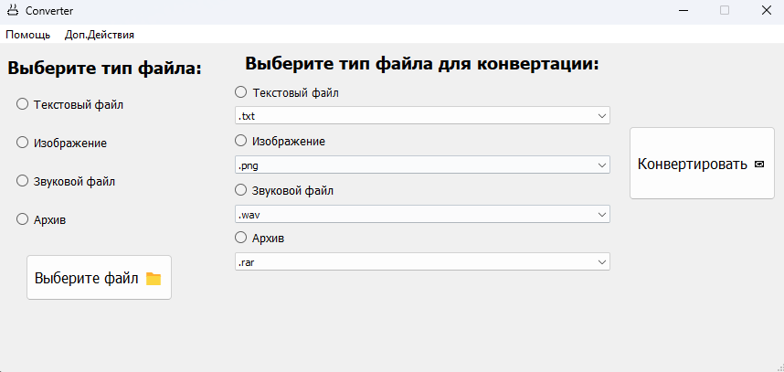
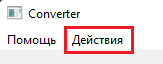
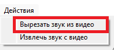
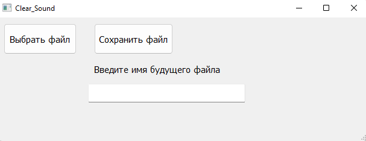
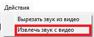
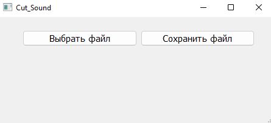
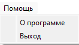
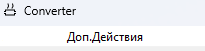

# О программе

Программа "Converter" предназначена для конвертации файлов в различные типы файлов, в ней так же присутствует
возможность вырезать и удалить звук из видео

## Как запустить?

Распакуйте архив с проектом "Converter". Запустите главную форму программы: Converter.py

## Как пользоваться функцией конвертации?

1. Выберите тип файла из предложенных в списке
2. Добавьте свой файл, нажав на кнопку "Выберите файл"
3. После добавления файла появится надпись: "Файл добавлен", если появилась надпись "Неверный формат файла", значит
   вы выбрали неверный файл, также возможно, что данный тип файла пока не поддерживается программой
4. Выбрать тип файла на выходе, сначала выбрать сам тип, а потом из выпадающего списка тип файла
5. Нажать кнопку "Конвертировать"
6. Выбранный файл сохранится уже в новом формате

## Как пользоваться функцией удаления звука из видео?

1. В Toolbar выберите "Действия" --> "Вырезать звук из видео"

* 
* 

2. Добавьте свой файл, нажав на кнопку "Выберите файл"

* 

2. Введите имя будущего видео без звука
3. Нажмите кнопку "Сохранить файл"
4. Файл сохраниться в директории программы

## Как пользоваться функцией вырезки звука из видео?

1. В Toolbar выберите "Действия" --> "Извлечь звук с видео"

* 
* 

2. Добавьте свой файл, нажав на кнопку "Выберите файл"

* 

3. Нажмите кнопку "Сохранить файл"
4. Файл сохраниться в той директории, из которой был добавлен файл

### Обзор Toolbar

1. Первая кнопка на toolbar - "Помощь", нажав на нее выскочит два действия: "О программе" и "Выход"

* 

* Нажав "О программе" вы можете узнать какие типы файлов поддерживает программа
* Нажав "Выход" приложение закрывается

2. Вторая кнопка на toolbar - "Действия", нажав на нее вы можете воспользоваться дополнительными функциями программы,
   описанными выше

* 